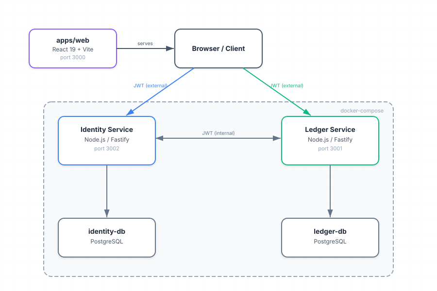
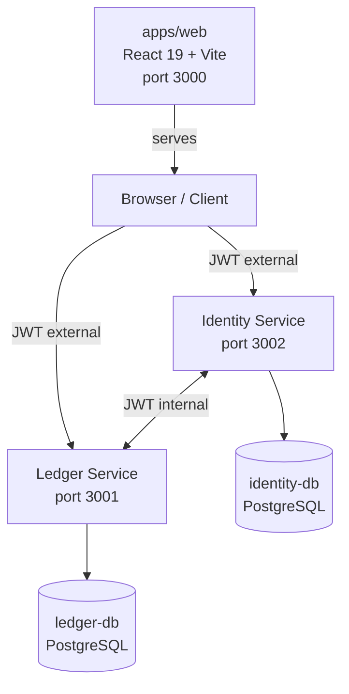

# ledger-api

A financial ledger reference implementation demonstrating fintech-grade patterns: ACID transactions, idempotency keys, pessimistic locking via `SELECT FOR UPDATE`, and JWT authentication across two microservices — with real-time SSE observability. Built with Node.js, Fastify, and PostgreSQL across five milestones using an AI-driven development workflow.

---

## Architecture



<details>
<summary>Text fallback (Mermaid)</summary>



</details>

---

## Tech Stack

| Layer       | Technology                          |
| ----------- | ----------------------------------- |
| Runtime     | Node.js 20 (ESM modules)           |
| HTTP        | Fastify                             |
| Database    | PostgreSQL 16                       |
| Containers  | Docker Compose                      |
| Auth        | JWT (jsonwebtoken)                  |
| Validation  | Zod                                 |
| Testing     | Jest, Playwright                    |
| Frontend    | React 19, Vite, Tailwind CSS        |

---

## Milestones

| Milestone | Status | Scope |
| --------- | ------ | ----- |
| M0 | ✅ | Monorepo bootstrap, shared package, CI skeleton |
| M1 | ✅ | Core microservices — identity, ledger, docker-compose, OpenAPI specs |
| M2 | ✅ | Reliability — integration tests, smoke tests, concurrency stress, pre-push gates |
| M3 | ✅ | Frontend — React 19 + Vite, Autoplay/Guided/Playground modes, DB Inspector, Playwright E2E |
| M4 | ✅ | Observability — SSE endpoints, Graph view, Terminal view, Replay mode |
| M5 | ✅ | UX overhaul — header redesign, packet animation, Terminal states, bug fixes, USD formatting |

---

## Frontend Demo (apps/web — port 3000)

Four modes:

- **Autoplay** — 13-step scripted flow with 800 ms delay between steps, runs the full user lifecycle automatically.
- **Guided** — same flow step-by-step with explanations and "why it matters" context for each step.
- **Playground** — interactive API explorer with accordion sections for all endpoints, live Bearer token management.
- **Observability** — real-time SSE graph with animated packet visualization + terminal log panel; replay mode with slow (3 s) / medium (500 ms) / fast (200 ms) speeds.

---

## Local Setup

### Prerequisites

- Docker Desktop (with Docker Compose v2)
- Node.js 20+

### Steps

1. Clone and enter the repository:

   ```bash
   git clone <repo-url>
   cd ledger-api
   ```

2. Copy the example environment file and set JWT secrets:

   ```bash
   cp .env.example .env
   ```

   Open `.env` and set:

   ```
   JWT_EXTERNAL_SECRET=<your-external-secret>
   JWT_INTERNAL_SECRET=<your-internal-secret>
   ```

3. Start databases and backend services:

   ```bash
   docker compose up -d
   ```

4. Install dependencies:

   ```bash
   npm install
   ```

5. Start the frontend dev server:

   ```bash
   cd apps/web && npm run dev
   ```

6. Open [http://localhost:3000](http://localhost:3000)

---

## API Overview

### Identity Service (port 3002)

| Method   | Path                  | Auth     | Description              |
| -------- | --------------------- | -------- | ------------------------ |
| `GET`    | `/health`             | None     | Health check             |
| `POST`   | `/users`              | None     | Create a new user        |
| `POST`   | `/auth`               | None     | Authenticate, get token  |
| `GET`    | `/users`              | External | List all users           |
| `GET`    | `/users/:id`          | External | Get user by ID           |
| `PATCH`  | `/users/:id`          | External | Update user              |
| `DELETE` | `/users/:id`          | External | Delete user              |
| `GET`    | `/events`             | External | SSE event stream         |
| `GET`    | `/internal/users/:id` | Internal | Verify user existence    |
| `GET`    | `/debug/db`           | None     | Database contents (dev)  |
| `DELETE` | `/debug/reset`        | None     | Reset database (dev)     |

### Ledger Service (port 3001)

| Method   | Path                        | Auth     | Description                |
| -------- | --------------------------- | -------- | -------------------------- |
| `GET`    | `/health`                   | None     | Health check               |
| `POST`   | `/transactions`             | External | Create a credit/debit entry|
| `GET`    | `/transactions`             | External | List transactions          |
| `GET`    | `/balance`                  | External | Get consolidated balance   |
| `GET`    | `/events`                   | External | SSE event stream           |
| `GET`    | `/internal/balance/:userId` | Internal | Get balance for a user     |
| `GET`    | `/debug/db`                 | None     | Database contents (dev)    |
| `DELETE` | `/debug/reset`              | None     | Reset database (dev)       |

> Debug endpoints (`/debug/db`, `/debug/reset`) are only registered when `NODE_ENV !== 'production'`.

---

## Development

### Available npm scripts

| Script              | Command                    | Description                       |
| ------------------- | -------------------------- | --------------------------------- |
| `typecheck`         | `npm run typecheck`        | Type-check all workspaces         |
| `lint`              | `npm run lint`             | Lint all workspaces               |
| `test`              | `npm test`                 | Run all unit tests                |
| `test:coverage`     | `npm run test:coverage`    | Run tests with coverage           |
| `format:check`      | `npm run format:check`     | Check formatting                  |
| `format:write`      | `npm run format:write`     | Fix formatting                    |
| `validate:openapi`  | `npm run validate:openapi` | Validate OpenAPI specs            |
| `test:smoke`        | `npm run test:smoke`       | Smoke tests (requires Docker)     |

### Single-service tests

```bash
npm -w @ledger/identity test
npm -w @ledger/ledger test
```

### Git hooks

Enable the pre-push CI gates:

```bash
git config core.hooksPath .githooks
```

### OpenAPI validation

```bash
npm run validate:openapi
```

Specs live in `docs/openapi/ms-identity.yaml` and `docs/openapi/ms-ledger.yaml`.

---

## Known Issues

1. **Graph blocks stay idle during replay** — state transitions (active/waiting/error) are not triggered by the replay iterator; only packet animation runs.
2. **Terminal does not replay alongside Graph** — the pill accumulates live events but does not show the replay banner or reproduce events sequentially during replay mode.
3. **Reset DB modal may render out of viewport** on some screen sizes.
